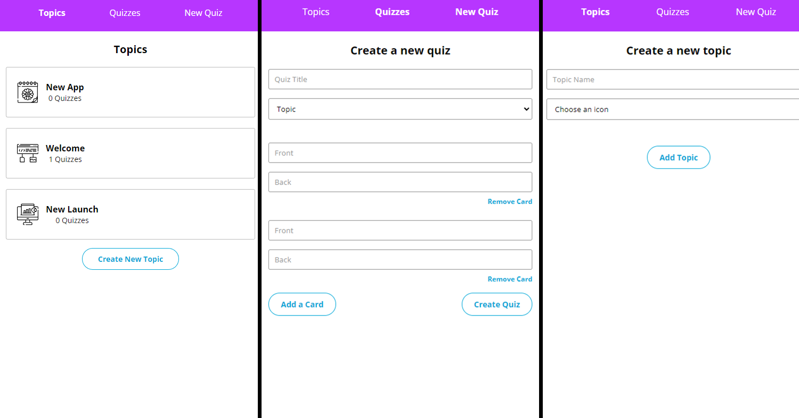

# Flashcards Challenge

Project developed as a challenge during the Front End Career Path Curriculum

## Table of Contents

- [Screenshots](#screenshots)
- [Setup](#setup)
- [Technologies](#technologies)
- [Goals](#goals)
- [Routes](#routes)
- [To Test](#totest)
- [Questions](#questions)

### Screenshots

Initial screen upon loading Flashcard Challenge.🙂

    

Example of use

    

### Setup

Git, Node.js, and NPM are required to run this project. Install Git by [following this](https://git-scm.com/book/en/v2/Getting-Started-Installing-Git). If you don't have Node and NPM installed please follow [these instructions](https://docs.npmjs.com/downloading-and-installing-node-js-and-npm).

1. Click the green code button:

2. From there, click the button to the right of the URL under HTTPS. This will copy the URL of the repository.

3. Then open your terminal or command line. If you haven't used the command line before [learn how to here](https://www.theodinproject.com/lessons/foundations-command-line-basics).

4. If you've got a folder where you keep projects, change directories into that folder. After that type this command:

`git clone https://github.com/carlos-req/flashcards.git `

This clones the repository to your local machine. It has a root directory called `flashcards` to store all the files.

5. Change directories into that folder:

`cd flashcards`

After that you can open the project in your text editor of choice. I use Visual Studio Code and launch it from the command line. [Learn how here](https://code.visualstudio.com/docs/setup/mac).

6. Once you have the project open, you need to install the dependencies. Run this in your command line from the root (adopt-a-pet folder) of the project:

`npm install`

7. After that finishes, run this to start the project:

`npm start`

### Technologies

- [React](https://reactjs.org/docs/getting-started.html)
- [Redux](https://redux.js.org/introduction/getting-started)
- CSS
- JavaScript

### Goals

Test the React-Redux and Redux Tool Kit material learned.

- configure individual slices modules using createSlice() ; ('@reduxjs/toolkit')
- configure a store module wth configureStore() and the individual slice modules. ('@reduxjs/toolkit')
- use useSelector() in conjunction with the defined selectors in each individual state slices to access the Store; ('react-redux)
- create selector's to access the states for manipulation; ('react-redux')
- with useDispatch() dispatch actions to the store to update rendering; ('react-redux')
- understand the view => middleware => Action (dispatch) => view Redux workflow

### Routes

- `/new-topic` – form to create a new topic
- `/topics` – index of all topics
- `/topics/:topicId` – page for an individual topic
- `/new-quiz` – form to create a new quiz
- `/quizzes` – index of all quizzes
- `/quizzes/:quizId` – page for an individual quiz

### To Test

1. Create topics
2. Create quizzes
3. Visit the page for an individual quiz and flip the cards over

### Questions

Is this appropriately scoped? Does it have too many features? Too few?
